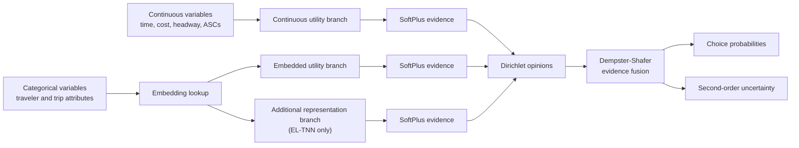

# Trusted Evidential Neural Networks for Travel Mode Choice

PyTorch implementation accompanying the paper **“Trusted evidential neural networks for travel mode choice.”**

[](https://doi.org/10.1007/s11116-026-10752-8)
[](https://doi.org/10.1007/s11116-026-10752-8)
[](https://www.python.org/)
[](https://pytorch.org/)

## Overview

This repository implements trusted neural-network choice models for travel mode choice. The proposed **Embeddings Trusted Neural Network (E-TNN)** and **Embeddings Learning Trusted Neural Network (EL-TNN)** extend embedding-based multinomial logit models with evidential deep learning and Dempster-Shafer evidence fusion.

The framework is designed to address two distinct problems:

- **heterogeneous representation:** categorical traveler attributes are mapped to interpretable embedding vectors and combined with continuous level-of-service variables; and
- **trusted prediction:** the model returns both travel-mode probabilities and sample-specific second-order uncertainty through a Dirichlet distribution.

Unlike a conventional Softmax classifier, the evidential models can represent insufficient or conflicting evidence explicitly. This allows predictive accuracy, calibration, behavioral interpretation, and uncertainty awareness to be evaluated within one framework.

## Paper-to-code naming

The model names used in the paper and the Python class names are not identical. The following mapping is essential when using the repository:

| Paper name | Code name | Description |
|---|---|---|
| MNL | `MNL` | Multinomial logit baseline |
| L-MNL | `L_MNL` | Learning multinomial logit |
| E-MNL | `E_MNL` | Embeddings multinomial logit |
| EL-MNL | `EL_MNL` | Embeddings learning multinomial logit |
| E-TNN | `TE_MNL` | Embeddings trusted neural network |
| EL-TNN | `TEL_MNL` | Embeddings learning trusted neural network |

TasteNet is evaluated in the paper but is not included in the main model registry in `train.py`.

## Method



For each alternative \(j\), non-negative evidence \(e_j\) defines a Dirichlet parameter:

$$
\alpha_j=e_j+1.
$$

The predictive probability and total uncertainty mass are:

$$
p_j=\frac{\alpha_j}{\sum_{k=1}^{J}\alpha_k},
\qquad
u=\frac{J}{\sum_{k=1}^{J}\alpha_k}.
$$

Higher Dirichlet strength corresponds to more evidence and lower uncertainty. Evidence generated by the continuous, embedded categorical, and additional representation branches is fused using the Dempster-Shafer combination rule.

### E-TNN

E-TNN contains two evidence sources:

1. the utility contribution from continuous variables; and
2. the utility contribution from categorical embeddings.

### EL-TNN

EL-TNN adds a third evidence source: a learned nonlinear representation derived from additional embedding dimensions. This branch is intended to capture utility components not explained by the original specification while preserving interpretable coefficients in the structured utility component.

## Data

The included data loader is configured for the **Swissmetro** stated-preference data set, with three alternatives:

- Train;
- Swissmetro; and
- Car.

The paper starts from 10,728 observations and retains 9,036 after preprocessing:

| Split | Observations | Share |
|---|---:|---:|
| Training | 7,234 | 80% |
| Testing | 1,802 | 20% |
| Total | 9,036 | 100% |

The final sample is imbalanced across the three observed choices:

| Alternative | Observations |
|---|---:|
| Train | 779 |
| Swissmetro | 5,177 |
| Car | 3,080 |

### Input variables

The code uses five continuous utility inputs:

| Code name | Meaning |
|---|---|
| `ASC_Car` | Alternative-specific constant for Car |
| `ASC_SM` | Alternative-specific constant for Swissmetro |
| `TT_SCALED(/100)` | Scaled travel time |
| `COST_SCALED(/100)` | Scaled travel cost |
| `Headway_Train_SM` | Train/Swissmetro headway |

The categorical input contains 12 traveler and trip attributes:

`PURPOSE`, `FIRST`, `TICKET`, `WHO`, `LUGGAGE`, `AGE`, `MALE`, `INCOME`, `GA`, `ORIGIN`, `DEST`, and `SM_SEATS`.

Across these categorical variables, the paper reports 81 unique categories.

### Included data files

`SM_data.py` loads the following preprocessed files from `data/`:

```text
data/
├── X_TRAIN.pkl
├── X_TEST.pkl
├── Q_train.csv
├── Q_test.csv
├── y_TRAIN.pkl
└── y_TEST.pkl
```

`X_*` contains the continuous utility inputs, `Q_*` contains categorical attributes, and `y_*` contains the observed choices.

## Repository structure

```text
RTCNN_main_2/
├── data/                         # Preprocessed Swissmetro inputs and labels
├── models_pytorch/
│   ├── models.py                # MNL, L-MNL, E-MNL, EL-MNL, E-TNN, and EL-TNN
│   ├── trainer.py               # Model-specific training loops
│   ├── utils.py                 # Evidential loss, DS fusion, and core metrics
│   ├── metrics.py               # Accuracy, F1, ECE, Brier score, VoT, elasticities
│   ├── analysis.py              # Sensitivity, ablation, and uncertainty analyses
│   ├── estimation.py            # Parameter and statistical estimation utilities
│   └── stat_utils.py            # Vuong test utilities
├── SM_data.py                   # Swissmetro data loader and categorical encoding
├── train.py                     # Train all registered models and print metrics
├── report_metrics.py            # Compact test-set metric report
├── full_analysis.py             # Complete analysis and artifact generation
├── gaussian_noise_experiment.py # Gaussian-noise robustness experiment
├── t_statistics_experiment.py   # Statistical comparison utilities
└── README.md
```

## Installation

Clone the repository:

```bash
git clone https://github.com/chdliuyue/RTCNN_main_2.git
cd RTCNN_main_2
```

Create and activate a virtual environment:

```bash
python -m venv .venv
```

```bash
# Linux/macOS
source .venv/bin/activate

# Windows PowerShell
.venv\Scripts\Activate.ps1
```

Install the packages imported by the current code:

```bash
pip install torch numpy pandas scikit-learn matplotlib scipy statsmodels adjustText
```

> The repository does not currently contain a `requirements.txt` or another pinned environment file. Record the Python, PyTorch, CUDA, NumPy, and scikit-learn versions used for reproduced experiments.

## Quick start

### Train and evaluate the registered models

```bash
python train.py
```

This script trains `MNL`, `E_MNL`, `EL_MNL`, `L_MNL`, `TE_MNL`, and `TEL_MNL`, then reports training- and test-set metrics.

### Generate a compact test report

```bash
python report_metrics.py
```

The report includes:

- Accuracy, macro F1, macro Precision, and macro Recall;
- Expected Calibration Error (ECE);
- multiclass Brier score;
- confusion matrix;
- direct elasticities; and
- Value of Time (VoT), when the required coefficients are available.

### Run the complete analysis suite

```bash
python full_analysis.py
```

Outputs are written to `analysis_outputs/`, including model summaries, confusion matrices, uncertainty distributions, parameter estimates, embedding-dimension sensitivity, EL-TNN ablation results, and Gaussian-noise uncertainty trends.

The complete suite retrains many models and is substantially more expensive than `train.py` or `report_metrics.py`.

## Default code configuration

The main scripts currently use:

| Hyperparameter | Value |
|---|---:|
| Epochs | 200 |
| Learning rate | 0.001 |
| Weight decay | 0.00001 |
| Batch size | 100 |
| Dropout | 0.2 |
| Additional embedding dimensions \(S\) | 2 |
| Hidden/convolution nodes | 15 |
| KL annealing period | 100 epochs |
| Optimizer | Adam |

CUDA is selected automatically when available.

### CPU compatibility note

The current `KL` implementation in `models_pytorch/utils.py` creates its uniform Dirichlet prior with `.cuda()`. Consequently, the evidential models (`TE_MNL` and `TEL_MNL`) require CUDA unless this line is made device-aware:

```python
beta = torch.ones((1, c), device=alpha.device)
```

The deterministic MNL variants do not use this evidential KL term.

## Results reported in the paper

The following values are the paper's mean test results over 100 training runs on Swissmetro. They are reported here for reference and are not newly reproduced by this README.

| Model | Accuracy | F1 | Precision | Recall | ECE | Brier score |
|---|---:|---:|---:|---:|---:|---:|
| MNL | 0.662 | 0.444 | 0.435 | 0.466 | 0.127 | 0.512 |
| L-MNL | 0.680 | 0.518 | 0.611 | 0.506 | 0.120 | 0.488 |
| TasteNet | 0.703 | 0.621 | 0.796 | 0.615 | 0.097 | 0.421 |
| E-MNL | 0.697 | 0.578 | 0.699 | 0.527 | 0.164 | 0.475 |
| EL-MNL | 0.716 | 0.599 | 0.763 | 0.562 | 0.111 | 0.443 |
| E-TNN | 0.705 | 0.588 | 0.730 | 0.560 | 0.108 | 0.450 |
| **EL-TNN** | **0.723** | **0.631** | **0.800** | **0.619** | **0.070** | **0.415** |

EL-TNN provides the highest Swissmetro accuracy, F1, precision, and recall, together with the lowest ECE and Brier score. The evidential loss values should not be compared directly with conventional cross-entropy values because they include the Dirichlet expected cross-entropy and KL regularization terms.

### Behavioral outputs

For the best-performing EL-TNN model, the paper reports negative and statistically significant coefficients for travel time, travel cost, and headway. It also reports:

- Value of Time: 1.879 sFr/min;
- direct elasticity of travel time: -0.974;
- direct elasticity of travel cost: -0.872; and
- direct elasticity of headway: -0.388.

These signs are consistent with random utility maximization: increases in time, cost, or headway reduce utility.

### Cross-data-set evaluation

The paper additionally evaluates Optima, Netherlands, and the London Passenger Mode Choice (LPMC) data sets. EL-TNN obtains the highest reported accuracy on Optima (0.739) and LPMC (0.741), and the highest F1 score on all three additional data sets. On Netherlands, E-MNL has a higher accuracy than EL-TNN (0.770 versus 0.763), while EL-TNN achieves the highest F1 score (0.680).

The current repository entry point and included files are configured for Swissmetro. Reproducing the three additional studies requires their corresponding data-preparation pipelines.

## Reproducibility notes

- The paper reports means and standard deviations over 100 training runs. `train.py` and `report_metrics.py` train each model once; an external repetition and aggregation loop is required to reproduce the paper tables.
- The paper's computational summary specifies learning-rate decay and early stopping based on validation F1 stability. The current trainer uses a fixed learning rate and retains the epoch with the highest training accuracy.
- The paper reports experiments on a single NVIDIA RTX 4090. Runtime and numerical results may differ on other hardware.
- Random seeds are not set consistently across the training scripts, so individual runs are not deterministic.
- TasteNet is a paper baseline but is not implemented in the main repository model suite.
- The supplied data loader targets Swissmetro; Optima, Netherlands, and LPMC are not wired into `SM_data.py`.
- For deterministic models, `models.py` returns Softmax probabilities, while `metrics.py` applies Softmax again during evaluation. Review this behavior before claiming exact reproduction of the paper metrics.
- The article's Data Availability statement cites `chdliuyue/RTCNN`, whereas this repository is `chdliuyue/RTCNN_main_2`. Record the exact repository and commit used in any replication study.

## Citation

If you use this repository, please cite:

```bibtex
@article{liu2026trusted,
  author  = {Liu, Yue and Liang, Guohua and Chen, Ziyu and Gao, Zhixiang},
  title   = {Trusted evidential neural networks for travel mode choice},
  journal = {Transportation},
  year    = {2026},
  doi     = {10.1007/s11116-026-10752-8}
}
```

**Paper:** Yue Liu, Guohua Liang, Ziyu Chen, and Zhixiang Gao (2026). “Trusted evidential neural networks for travel mode choice.” *Transportation*. [https://doi.org/10.1007/s11116-026-10752-8](https://doi.org/10.1007/s11116-026-10752-8)

## Funding

This research was supported by:

- the National Natural Science Foundation of China (Grant No. 52572332);
- the Key Research and Development Program in Shaanxi Province (Grant No. 2024GX-YBXM-131); and
- the Xi'an Science and Technology Plan Program (Grant No. 2024JH-GXFW-0060).

## License

This repository currently does not include an open-source license. Please contact the authors before reusing or redistributing the code or included data.
